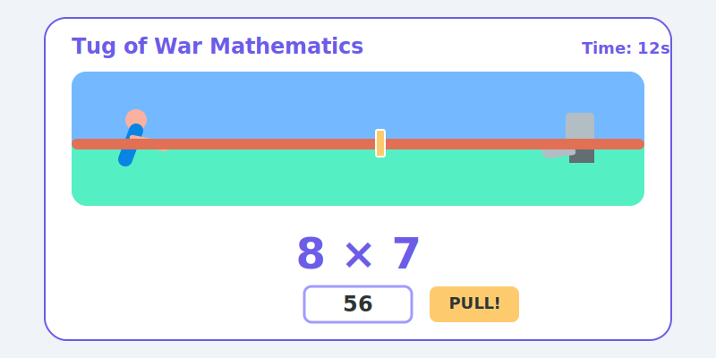

# Tug of War Mathematics 🪢🔢

Welcome to **Tug of War Mathematics**, a fun, fast-paced educational game designed to help kids master their math skills through the thrill of competition! 

Built as a **Progressive Web App (PWA)**, this game combines learning with an interactive "tug of war" mechanic. Whether you're on a phone, tablet, or computer, you can jump straight into the match.



---

## 🎮 How the Game Works

The goal is simple: **Out-math your opponent to win the tug of war!**

### Single Player
1.  **Choose Your Match**: Pick an operation—Addition, Subtraction, Multiplication, or Division.
2.  **Select Your Level**: Start with Level 1 (Easy) and work your way up to Level 3 (Hard). Higher levels mean tougher questions and a faster computer opponent!
3.  **The Arena**: You'll see a rope with a marker in the middle. 
    *   **Correct Answer**: Gives you a boost! You pull the rope toward your side.
    *   **Incorrect Answer**: You lose your footing! The computer pulls the rope toward its side.
4.  **Winning**: Pull the marker all the way to your side (the left side) to claim victory.

### Two Player (PvP)
1.  **Same Device Battle**: Compete with a friend on the same device!
2.  **Split Screen Questioning**: Both players get their own question and answer area.
3.  **Pull for Victory**: Each correct answer pulls the rope toward you. First one to pull the marker to their side wins!

---

## 🚀 Technical Highlights

This project was built with modern web standards to ensure it's lightweight, fast, and accessible anywhere.

*   **Vite & Vanilla JS**: No heavy frameworks—just pure, optimized JavaScript for a snappy experience.
*   **PWA Ready**: Thanks to a built-in Service Worker and Manifest, the game works **offline** and can be "installed" directly to your home screen.
*   **Responsive Design**: The UI is crafted with CSS Flexbox and custom typography (using the 'Outfit' font family) to look great on any screen size.
*   **Dynamic Math Engine**: A custom logic module that generates balanced, age-appropriate questions based on the selected difficulty level.

---

## 🛠️ Getting Started

### Prerequisites
You'll need [Node.js](https://nodejs.org/) installed on your machine.

### Installation
1.  Clone or download the project folder.
2.  Open your terminal/command prompt in the directory.
3.  Install dependencies:
    ```bash
    npm install
    ```

### Running the Game
To start the development server:
```bash
npm run dev
```
Once it's running, follow the local link (usually `http://localhost:5173`) to start playing!

---

## 📁 Project Structure

*   `index.html`: The core structure and game screens.
*   `src/main.js`: The "brain" of the game—handles the game loop, PWA setup, and UI updates.
*   `src/math.js`: The math engine responsible for generating all the questions.
*   `src/style.css`: All the custom styling, including the rope animations and layout.
*   `src/state.js`: Manages the game's internal state (score, rope position, etc.).
*   `public/`: Contains assets like the PWA manifest and service worker.

---

## 🌈 Why Tug of War Mathematics?

Most math apps feel like digital worksheets. We wanted to build something that felt like a **game first**. By adding the physical metaphor of a tug of war, kids get instant visual feedback on their progress, making the "grind" of practicing multiplication tables feel like a high-stakes arena battle.

---

*Built with ❤️ for the next generation of mathematicians.*

---
**Author**: Toyyib Olalekan
